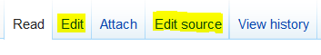
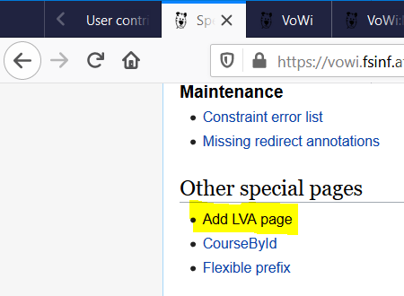

# Vowikiathon

Kristina (kwe), Lina (linaw), Mariya (maryamou), Renée Sophie (pheara)

<!--
20mins + 5mins Q&A
-->

---

# What is VoWi

- MediaWiki
- student generated content
- courses described from a student perspective
- materials (scripts, slides, old exams, exercise solutions, etc)
- licensed under GNU Free Document License (~CC-BY-SA with caveats)

<aside class="notes">
VoWi is a **MediaWiki** (~Wikipedia) with **student-generated content describing courses** from a student perspective. Additionally it holds many **materials** like scripts, slide-sets, old exams, exercise-solutions, etc.

All content is licensed under the **GNU Free Document License** (GFDL) 1.3 (~CC-BY-SA, but...)
~CC-BY-SA, but: derivatives under same license, has invariant sections, forbids DRM broadly (also proprietary storage formats and disk-encryption).
switching was discussed but would mean starting a new vowi for all new content, essentially splitting the userbase/content.

License

GFDL:

- allows: copy, redistribute, modify (except for invariant sections).
- derivates: under _same_ license.
- must attribute.
- changes must be logged
- disclaimers, license, etc must be kept
- forbids DRM (but with a broad wording that technically also forbids using proprietary storage formats and disk encryption)

not compatible with gpl, not compatible with CC-SA. for public wiki-content _older than Nov 1, 2008_ it's possible to also offer it under CC-BY-SA 3.0 (they wanted to prevent ppl from gaming the system by offering it as a wiki afterwards and then switching licenses for it)

switching was discussed but would mean starting a new vowi for all new content, essentially splitting the userbase/content.

</aside>

---

# Why?

- outdated course information
- lack of english content
- provide access to offline materials (in closed groups etc)
- encourage new editors

<aside class="notes">
* outdated course information
* lack of english content <!-course descriptions and especially curriculum ->
* provide access to offline materials (in closed groups etc)
* encourage new editors
</aside>

---

# What?

- focused on MHCC curriculum and other english master’s programs
- find and contact other students to upload their materials
- stubs for at least all mandatory course in each curriculum
- content for the mandatory courses and some others

<aside class="notes">
* focused on MHCC curriculum and other english master’s programs <!-because for BSc more people are contributing ->
* find and contact other students to upload their materials
* stubs for at least all mandatory course in each curriculum
* content for the mandatory courses and some others <!- we've done as well ->
<aside>
---

# What?

- included "How to Study" for MHCC{1}
- translated information on how to get a diploma thesis{1}
- updating lots of references, course data, deprecation info and setting redirects
- communication work with VoWi admins, GuT and TISS

{1}: https://wiki.fsinf.at/wiki/Kategorie:Studienplanung

<aside class="notes">
1-2 sentences:

- Renée: Mostly creating pages for courses I've done, doing translations and the stats.

- Kristina: Mostly communication, trying to keep on top of what we did/need to do, checking in with others, asking for permission to use information from GuT (denied) and TISS (granted), annoying VoWi admin_as with requests, questions and suggestions. Also translating and writing down meta information on how to study and minor improvements to inter-wiki links.

- Lina: Mostly creating pages and content, finding materials, suggested How To add materials

- Before-after screenshots
- delta: no english content => quite some and many stubs (TODO exact numbers)
- highlights / examples
- everyone describe in 1-2 sentences what one's done. for highlights, e.g. if proud of a specific page, mention it

note: 1 curriculum, many curricula. yay, latin!

</aside>

---

# Example Page

[TU_Wien:User_Research_Methods_VU_(Frauenberger)](https://vowi.fsinf.at/wiki/TU_Wien:User_Research_Methods_VU_(Frauenberger))

---

# In Numbers

- full pages (of length 200-1200w): 17
- translations: 7
- stubs (entering basic course data): 77
- small changes\*: 33
- materials added: 42

\*referencing, setting redirects, deprecating, updating course data, edits of a few sentences

---

## Other Effects

- admins looked into translation
  - some templates translated
  - landing page translated
  - no seperate vowi-version
- inspired how-to-study/meta-page for DSc

<aside class="notes">
- admins looked into translation
  - some templates translated <!- e.g. databox ->
  - landing page translated
  - no seperate vowi-version
- inspired how-to-study/meta-page for DSc
</aside>

---

# Original Vision vs Results

- `[ ]` translate templates
- `[ ]` edit TU building plans
- `[x]` stubs for mandatory courses
- `[x]` additional materials
- `[x]` content for all courses we did in the last 3 years
- `[ ]` english version for vowi
- `[x]` provide english version for curriculum

<aside class="notes">
* { } translate templates <!- planned but didn’t get to it - however user/admin gittenburg started doing that due to our project ->
* { } edit TU building plans <!- permission denied by GuT ->
* {x} stubs for mandatory courses
* {x} additional materials
* {x} content for all courses we did in the last 3 years
* { } english version for vowi <!- discussion with VoWi admins => decided against for maintenance reasons: more outdated content, split of pp editing de vs en; only one language per course anyway ->
* {x} provide english version for curriculum

en vowi concerns: with 2 vowi instances, there would be more outdated content, also split between people editing de vs people editing en, no point in having en versions of bsc courses only offered in german, basically instant divergence because of changing lva names,… in a nutshell: one instance is easier to maintain than two instances

</aside>

---

# Organisation approach

- Trello boards for:
  - team activities
  - stubs and content creation
- Poking 👉 other people (TU, fsinf, students)
- Weekly meetings via Jits, check-in
- Notes in Cryptpads
- Communication via Slack

<aside class="notes">
- Trello boards for:
  - team activities <!-(not too actively used)->
  - stubs and content creation <!-(better task-granularity, actively used) ->
- Poking 👉 other people (TU, fsinf, students)
- Weekly meetings via Jits, check-in
- Notes in Cryptpads
- Communication via Slack

<!-

- jitsi has good random names:
  - perfect children search responsibly
    ->
    </aside>

---

# Lessons & Issues

- Slack message limit 😐
- other curriculums are also broken
- interaction with admin_as
- organisation
- the stats plugin{1} only works with wikipedia

<aside class="notes">
- Slack message limit 😐 <!- eating old msgs and mats related to mhcc-courses ->
- other curriculums are also broken <!- courses that are mandatury _and_ elective, courses in curriuculum in TISS but not in curriculum-doc, courses with misspelt names, courses never offered, courses with retired main lecturer + no replacement ->
- interaction with admin_as <!- no main channel, only (bi-)weekly conversations among them. divergent opinions ad adding english content and where to put meta-info ->
- organisation <!- we are bad at keeping trello up-to-date ->
- the stats plugin{1} only works with wikipedia

{1}: <https://xtools.wmflabs.org/>

</aside>

---

# Lessons & Issues

- changing page-title @ wiki => new mattermost-channel
- VoWi-syntax and naming conventions
- courses change names way too often
- can't switch off GFDL

<aside class="notes">
- changing page-title @ wiki => new mattermost-channel <!- ppl will stay in old channel => splitting community. +brakes links. ->
- VoWi-syntax and naming conventions <!-hard and confusing. unclear where to add ‘TU Wien:’ prefixes (namespacing) or ‘(lecturer name)’ postfixes, lots of trial&error&asking admin_as->
- courses change names way too often
- can't switch off GFDL <!- switching to CC-BY-SA was discussed but would mean starting a new vowi for all new content, essentially splitting the userbase/content. ->
</aside>

---

# 101 - Attaching

e.g. scripts, old exams, exercise-solutions, etc

---

# 101 - Attaching

<aside class="notes">
- No file: create subpage
- File: upload
- External: add link
</aside>

---

# 101 - Attaching

<aside class="notes">
- No file: create subpage
- File: upload
- External: add link
</aside>

---

# 101 - Editing

---

# VoWi 101 - Editing Pages

---

# VoWi 101 - Editing Pages

---

# 101 - Stubs

---

# 101 - Stubs

---

# 101 - Stubs

<https://vowi.fsinf.at/wiki/Spezial:LVA-Seite_anlegen>

---

# 101 - Stubs

also see: <https://vowi.fsinf.at/wiki/Vorlage:LVA-Daten>

---

# 101 - Stubs

---

# VoWi 101 - Creating Stubs

---

# What you can do now

Go and edit vowi, e.g. for FOT!
